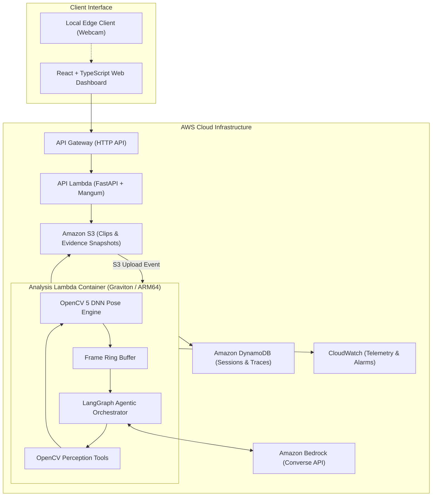
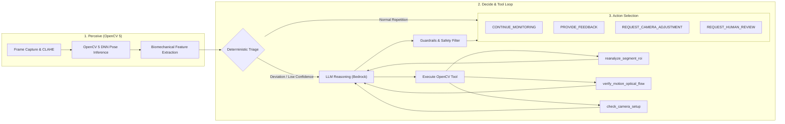

# Kinevra

> **Agentic Computer Vision for Rehabilitation Movement Monitoring**  
> *It watches the movement, so you can focus on recovery.*

[](https://opencv.org/)
[](https://aws.amazon.com/ec2/graviton/)
[](https://aws.amazon.com/bedrock/)
[](https://www.python.org/)
[](https://github.com/astral-sh/ruff)
[](https://mypy-lang.org/)

Kinevra is an agentic computer vision framework built to monitor movement during home rehabilitation exercises. Powered by OpenCV 5 DNN pose estimation and Amazon Bedrock via LangGraph, Kinevra continuously measures biomechanical features, detects execution deviations, dynamically triggers secondary computer vision re-perception tools, and escalates flagged sessions to human clinical reviewers.

Built for the **OpenCV AI Competition 2026, powered by AWS** (Featured Path: **Agentic Vision**).  
Developer: **Nishant Narudkar**

---

> **Safety Disclaimer:** Kinevra is an assistive research prototype designed for movement monitoring between physiotherapy visits. It is not a medical device and does not provide medical diagnoses. Users are instructed to cease exercise immediately if discomfort or pain occurs.

---

## Core Philosophy

- **Computer vision measures.** All joint angles, Range of Motion (ROM), angular velocities, and image quality metrics are computed deterministically using OpenCV 5. LLMs are never used to compute spatial measurements or joint metrics.
- **The agent decides when to re-perceive.** The agent (LangGraph + Amazon Bedrock) evaluates movement trajectories over time. When landmark tracking confidence is low or anomalies occur, it actively invokes secondary OpenCV perception tools to re-analyze video segments.
- **AWS processes vision and intelligence at scale.** OpenCV 5 video processing runs inside cloud container environments hosted on AWS Lambda (Graviton/arm64) integrated with Amazon Bedrock, DynamoDB, S3, and CloudWatch.
- **Humans remain responsible for healthcare decisions.** Sessions exhibiting persistent or severe deviations are escalated to a clinician review queue complete with annotated visual start, peak, and end keyframe evidence.

---

## Architecture & Workflows

### System Architecture

The following diagram illustrates the deployment topology across the client interface, AWS serverless infrastructure, OpenCV 5 vision pipeline, and Amazon Bedrock agent loop.



### Perception, Decision, and Action Loop

Unlike static classification pipelines, Kinevra runs an active perception loop. OpenCV tools are invoked by the agent during runtime reasoning to gather additional evidence before committing to an action.



### OpenCV 5 Perception Tools

1. **`reanalyze_segment_roi(rep_index, scale)`**: Crops the target limb Region of Interest (ROI) from buffered frames, applies CLAHE contrast adjustment, upsamples resolution, and re-executes ONNX pose estimation via `cv2.dnn` to resolve low-confidence tracking.
2. **`verify_motion_optical_flow(rep_index)`**: Computes dense optical flow (`cv2.calcOpticalFlowFarneback`) across arm ROI frames to differentiate true movement irregularity from keypoint estimation jitter.
3. **`check_camera_setup(window_s)`**: Calculates Laplacian variance blur, brightness distribution, framing boundaries, and subject count to instruct the user on setup adjustments.
4. **`render_evidence_snapshot(rep_index)`**: Generates annotated start, peak, and end keyframe images with skeleton overlays, joint angle arcs, and HUD metrics for clinical audit.

---

## For Judges

- **Exercise Focus:** Shoulder Abduction (lateral arm raise in frontal camera view).
- **Evaluation Endpoint:** Upload custom video clips or select pre-configured test scenarios (Good Form, Fatigue Decline, Trunk Lean Compensation, Poor Lighting).
- **Decision Trace Inspection:** Each decision includes a full audit trace. Steps marked with `changed_assessment: true` indicate moments where an OpenCV perception tool re-analysis altered the final recommendation.
- **Technical Documentation:**
  - Technical Report: [`docs/REPORT.md`](docs/REPORT.md)
  - Architecture Specifications: [`docs/architecture.md`](docs/architecture.md)

---

## Repository Layout

```
kinevra/
├── PROJECT.md                 # Master project specification & phase roadmap
├── CLAUDE.md                  # Development guidelines & constraints
├── README.md                  # System overview & setup instructions
├── Makefile                   # Automation targets (setup, test, lint, deploy)
├── pyproject.toml / uv.lock   # Dependency manifest & lockfile
├── configs/
│   ├── default.yaml           # Global system parameters
│   └── exercises/             # Exercise configurations & baseline thresholds
│       └── shoulder_abduction.yaml
├── docs/
│   └── decisions/             # Architecture Decision Records (ADRs)
├── kinevra/                   # Core Python application package
│   ├── schemas.py             # Pydantic v2 data models
│   ├── config.py              # Configuration manager
│   ├── vision/                # OpenCV 5 frame buffer, quality & flow
│   ├── pose/                  # cv2.dnn ONNX pose estimation engine
│   ├── movement/              # Biomechanical geometry & rep state machine
│   ├── evaluation/            # Baseline rule-based classification
│   ├── evidence/              # Evidence builder module
│   ├── agent/                 # LangGraph state graph, tools, guardrails & trace
│   ├── pipeline/              # Live webcam & batch clip orchestrators
│   └── api/                   # FastAPI application & Mangum adapter
├── lambda/                    # AWS Lambda Docker container files (ARM64)
├── scripts/                   # CLI execution & evaluation scripts
├── tests/                     # Test suite
│   ├── unit/                  # Fast pytest suite
│   ├── fixtures/              # Synthetic test fixtures
│   └── agent_scenarios/       # Scripted agent perception scenarios
├── web/                       # React + TypeScript judge dashboard
└── infra/                     # AWS CDK infrastructure definition (Python)
```

---

## Shared Data Contracts (`kinevra/schemas.py`)

All inter-module communication relies on validated Pydantic v2 schemas:

| Schema | Purpose |
|---|---|
| `PoseFrame` | Raw landmark coordinates, visibility scores, quality flags, and person count |
| `FrameFeatures` | Computed joint angles (`shoulder_abduction`, `elbow_flexion`, `trunk_lean`) and angular velocities |
| `RepMetrics` | Repetition timings, maximum ROM, smoothness metric, and rule-based classification |
| `SessionEvidence` | Baseline ROM delta, trajectory trends, and consecutive deviation counts |
| `AgentDecision` | Selected `AgentAction`, rationale text, evidence links, and full trace log |
| `TraceStep` | Audit record of individual graph nodes, tool inputs, outputs, and assessment changes |
| `ReviewEvent` | Clinician escalation payload containing annotated visual keyframe snapshots |

---

## Quickstart & Setup

### Prerequisites

- **Python 3.12**
- **uv** package manager (recommended) or standard `pip` / `venv`

### Installation

```bash
# Clone the repository
git clone https://github.com/nishnarudkar/Kinevra.git
cd Kinevra

# Install dependencies with GUI support (for local webcam preview)
make setup

# Or using uv directly:
uv sync --extra gui
```

> **Note on OpenCV 5:** Kinevra installs `opencv-python==5.0.0.93` for local development (GUI enabled) and `opencv-python-headless==5.0.0.93` for CI and AWS Lambda container environments.

### Verification & Testing

```bash
# Verify OpenCV 5 installation
python -c "import cv2; print(cv2.__version__)"
# Output: 5.0.0.93

# Run unit test suite
make test
# Alternative without make: .\.venv\Scripts\pytest.exe -m "not bedrock and not camera"

# Run linter and static type checker
make lint
# Alternative without make: .\.venv\Scripts\ruff.exe check . && .\.venv\Scripts\mypy.exe kinevra
```

---

## Safety & Responsible AI

1. **Non-Diagnostic Terminology Policy:** Code, system prompts, and UI copy enforce non-diagnostic terminology (e.g., *"movement deviation"*, *"reduced range of motion"*, *"trunk compensation"*). Clinical diagnostic labels are strictly excluded.
2. **Deterministic Action Guardrails:** All agent outputs are validated by `guardrails.py`. Inadequate image quality automatically forces camera setup requests. Persistent deviations trigger mandatory clinician escalations.
3. **Data Protection & Retention:** Video uploads are processed ephemerally on AWS Lambda, retained under 24-hour auto-deletion S3 lifecycle policies, and stored only as anonymous derived numerical metrics.

---

## License & Credits

- **Developer:** Nishant Narudkar
- **Competition:** OpenCV AI Competition 2026, powered by AWS
- **License:** MIT License
